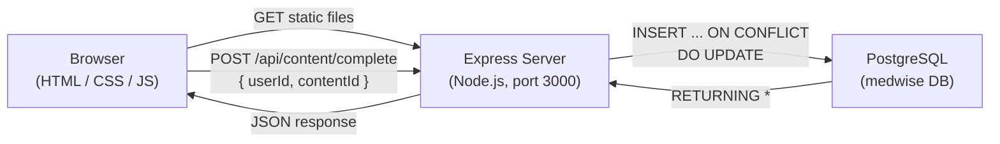

# MedWise — Spotting Medical Misinformation

## 1. App Summary

MedWise is an educational web application designed to help users identify AI-generated and misleading medical information found online. The platform offers interactive quizzes that test a user's ability to distinguish credible health claims from misinformation, along with a curated learning library of videos, articles, guides, and infographics. Users can create an account, track their progress across quizzes and content, and earn achievement milestones as they improve their health-literacy skills. The backend is powered by Node.js with Express and connects to a PostgreSQL database that stores user accounts, quiz data, content progress, and milestones. A "Mark as Done" button on the Learn page serves as the vertical-slice feature: clicking it sends a request to the server, which writes to the database and returns the updated state so the UI reflects it immediately. The change persists after a page refresh, proving true database-backed storage. MedWise is intended for educational purposes and demonstrates a full-stack architecture with a working frontend-to-database round trip.

## 2. Tech Stack

| Layer      | Technology                          |
|------------|-------------------------------------|
| Frontend   | HTML5, CSS3, vanilla JavaScript (ES6+) |
| Backend    | Node.js v18+, Express 4             |
| Database   | PostgreSQL 14+                       |
| Auth       | bcryptjs (password hashing)          |
| Config     | dotenv (environment variables)       |
| CORS       | cors middleware                      |

## 3. Architecture Diagram



```
┌──────────────┐       HTTP        ┌──────────────────┐      SQL       ┌──────────────┐
│   Browser    │ ───────────────── │  Express Server   │ ────────────── │  PostgreSQL   │
│  (HTML/JS)   │  GET / POST JSON  │  (backend/)       │  pg pool       │  (medwise)    │
└──────────────┘                   └──────────────────┘                └──────────────┘
      │                                    │                                  │
      │  1. Click "Mark as Done"           │                                  │
      │ ──POST /api/content/complete──►    │                                  │
      │                                    │  2. INSERT ... ON CONFLICT        │
      │                                    │ ──parameterized query──────────►  │
      │                                    │                                  │
      │                                    │  3. RETURNING updated row        │
      │                                    │ ◄─────────────────────────────── │
      │  4. JSON { progress }              │                                  │
      │ ◄─────────────────────────────     │                                  │
      │                                    │                                  │
      │  5. UI updates to "Completed ✓"    │                                  │
      └───────────────────────────────────────────────────────────────────────┘
```

## 4. Prerequisites

| Tool        | Minimum Version | Download Link                             | Verify Command       |
|-------------|----------------:|-------------------------------------------|----------------------|
| **Node.js** |           v18+  | [https://nodejs.org/](https://nodejs.org/) | `node -v`           |
| **npm**     |            v9+  | (bundled with Node.js)                     | `npm -v`            |
| **PostgreSQL** |         14+  | [https://www.postgresql.org/download/](https://www.postgresql.org/download/) | `psql --version` |
| **Git**     |         latest  | [https://git-scm.com/](https://git-scm.com/) | `git --version`  |

## 5. Installation and Setup

### 5a. Clone the repository

```bash
git clone <your-repo-url>
cd Med-Wise-main
```

### 5b. Create the database and load schema + seed data

```bash
psql -U postgres -c "CREATE DATABASE medwise;"
psql -U postgres -d medwise -f db/schema.sql
psql -U postgres -d medwise -f db/seed.sql
```

> `schema.sql` creates all 8 tables. `seed.sql` inserts sample users, content, quizzes, questions, attempts, progress records, milestones, and earned achievements.

### 5c. Configure environment variables

```bash
cp backend/.env.example backend/.env
```

Then edit `backend/.env` with your PostgreSQL credentials:

```
DB_HOST=localhost
DB_PORT=5432
DB_USER=postgres
DB_PASSWORD=your_password_here
DB_NAME=medwise
PORT=3000
```

### 5d. Install backend dependencies

```bash
cd backend
npm install
```

## 6. Running the Application

Start the backend server (which also serves the frontend static files):

```bash
cd backend
npm start
```

You should see:

```
MedWise server running at http://localhost:3000
API available at http://localhost:3000/api
```

Open **http://localhost:3000** in your browser to use the app.

To verify the database connection, visit **http://localhost:3000/api/health** — you should see:

```json
{ "status": "ok", "time": "2026-..." }
```

## 7. Verifying the Vertical Slice ("Mark as Done" Button)

The **"Mark as Done"** button on the **Learn** page (`content.html`) is the vertical-slice feature that demonstrates a full frontend → backend → database round trip.

### Step-by-step verification

1. **Start the server** (if not already running):
   ```bash
   cd backend && npm start
   ```

2. **Open the app** at **http://localhost:3000/signin.html**

3. **Sign in** with a seed-data account:
   - Email: `jane.doe@example.com`
   - Password: `password123`

4. **Navigate to the Learn page**: click **Learn** in the navbar (or go to http://localhost:3000/content.html)

5. **Click "Mark as Done"** on any content card (e.g., "How AI Generates Fake Medical Articles")
   - The button text changes to **"Saving..."** briefly
   - Then it becomes a green **"Completed ✓"** badge

6. **Refresh the page** (Ctrl+R / Cmd+R)
   - The card still shows **"Completed ✓"** — proving the data persisted in the database (not just localStorage)

7. **Confirm in the database** (optional but proves DB storage):
   ```bash
   psql -U postgres -d medwise -c "SELECT * FROM user_content_progress;"
   ```
   You should see a row for the content item you just marked, with `completed = true`.

8. **Undo test** (optional): Click the green "Completed" button again — it sends `POST /api/content/uncomplete`, deletes the row from `user_content_progress`, and the button reverts to "Mark as Done".

### How it works under the hood

| Step | Layer    | What happens |
|------|----------|--------------|
| 1    | Frontend | `toggleContentDone()` sends `POST /api/content/complete` with `{ userId, contentId }` |
| 2    | Backend  | Express route in `backend/routes/content.js` executes parameterized SQL |
| 3    | Database | `INSERT INTO user_content_progress ... ON CONFLICT DO UPDATE SET completed = true` |
| 4    | Backend  | Returns `RETURNING *` row as JSON |
| 5    | Frontend | Updates localStorage + re-renders card with green "Completed" badge |
| 6    | Refresh  | `loadProgressFromDB()` runs on page load, fetching `GET /api/content/progress/:userId` from DB |

### API endpoint details

```
POST /api/content/complete
Content-Type: application/json

Request:  { "userId": 1, "contentId": "vid-ai-fake" }
Response: { "message": "Content marked as completed", "progress": { "id": 7, "user_id": 1, "content_id": "vid-ai-fake", "completed": true, "viewed_at": "..." } }
```

---

## Project Structure

```
MedWise/
├── backend/              # Node.js + Express API server
│   ├── routes/
│   │   ├── auth.js       # POST /api/auth/register, /api/auth/login
│   │   └── content.js    # GET/POST content & progress endpoints
│   ├── db.js             # PostgreSQL connection pool
│   ├── server.js         # Express entry point
│   ├── .env.example      # Template for DB credentials
│   └── package.json      # Backend dependencies
├── db/                   # Database scripts
│   ├── schema.sql        # Creates all 8 tables
│   └── seed.sql          # Sample data for testing
├── css/styles.css        # Stylesheet
├── js/
│   ├── main.js           # Nav, mobile menu, scroll animations
│   ├── progress.js       # LocalStorage progress tracker
│   └── quiz.js           # Quiz logic
├── index.html            # Home page
├── quiz.html             # Quiz page
├── content.html          # Learn page (has the working button)
├── about.html            # About page
├── account.html          # Progress dashboard
├── signin.html           # Sign in
├── register.html         # Register
└── reset-password.html   # Password reset
```

## Database (8 Tables)

| Table                    | Purpose                                 |
|--------------------------|-----------------------------------------|
| `users`                  | User accounts and authentication        |
| `content`                | Learning library items                  |
| `quizzes`                | Quiz definitions                        |
| `quiz_questions`         | Questions belonging to each quiz        |
| `quiz_attempts`          | Records every quiz a user has taken     |
| `user_content_progress`  | Tracks which content each user completed|
| `milestones`             | Achievement definitions                 |
| `user_milestones`        | Which milestones each user has earned   |
